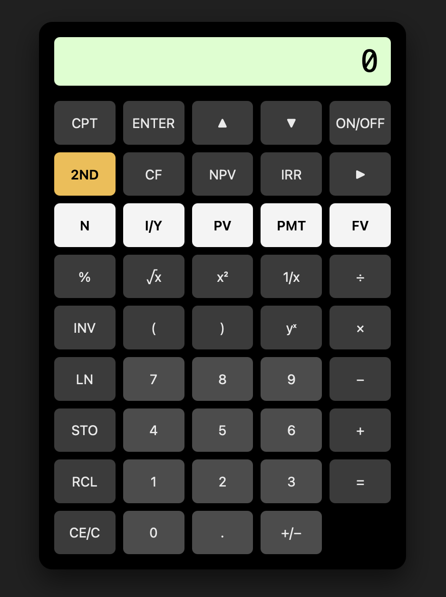

# financial-calculator

<a href="https://hoyongj.github.io/financial-calculator/">
  
</a>


# Issue

1. NON-FUNCTION KEYS: `▲`, `▼`, `▶`, `CF`, `NPV`, `IRR`, `(`, `)`, `INV`
2. size optimization
3. when value exist -> new number -> clear
4. similarly -> TVM -> new number -> clear the display
5. `2ND` do nothing


# More function

1. Previous keys history


# Updating Publish

```sh
git checkout publishing
git merge main
git push origin publishing
git checkout main
```